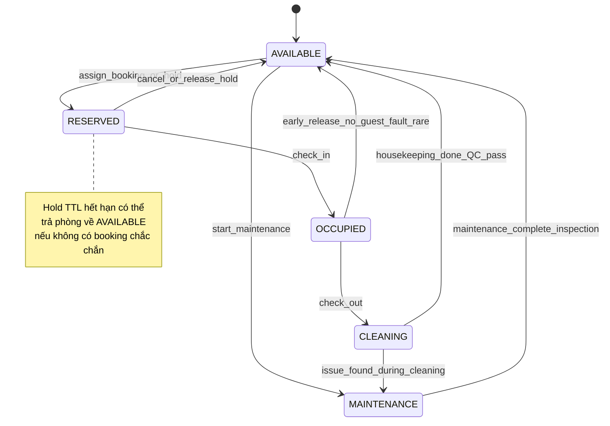

# Kế hoạch hệ thống quản lý khách sạn

> Tài liệu mô tả kiến trúc, luồng nghiệp vụ và các biện pháp giảm rủi ro cho một nền tảng quản lý khách sạn đầu cuối. Các chủ đề đã rà soát: đồng thời đặt phòng, lược đồ giá sớm, hỗ trợ khách qua chat người–người (tuỳ chọn), idempotency webhook thanh toán, kiểm duyệt đánh giá, push FCM/APNs, múi giờ UTC vs timezone tài sản, và chính sách hủy với placeholder cho sản phẩm.

---

## 1. Tổng quan & phạm vi MVP

### 1.1 Tổng quan

Hệ thống phục vụ **chủ khách sạn / chuỗi**, **nhân viên lễ tân & buồng phòng**, và **khách** qua **web quản trị** và **ứng dụng di động**.

Trọng tâm MVP:
- Đặt phòng có kiểm soát tồn kho
- Thanh toán có đối soát
- Trạng thái phòng nhất quán
- Trải nghiệm cơ bản sau đặt: thông báo; **tuỳ chọn nhưng khuyến nghị:** chat trực tiếp khách ↔ lễ tân qua WebSocket Socket.io (không trợ lý tự động); đánh giá có kiểm duyệt

### 1.2 Phạm vi MVP (đưa vào phát hành đầu)

| Hạng mục | Trong MVP | Ghi chú rủi ro đã xử lý |
|---|---|---|
| Đa tài sản (multi-property) | Có | Mỗi property có IANA timezone riêng |
| Loại phòng & hạng giá theo đêm | Có | `daily_rate` + snapshot `booking_line_item` |
| Giữ chỗ (hold) có TTL | Có | Tránh "treo" tồn kho |
| Thanh toán qua cổng chính | Có | Webhook idempotent + retry an toàn |
| Web admin RBAC | Có | JWT + vai trò tối thiểu |
| Mobile khách: tìm kiếm, đặt, hủy theo policy | Có | Policy hủy có placeholder `X` giờ |
| Thông báo đẩy (booking/payment) | Có (tuần 0–1) | Expo + FCM/APNs checklist |
| Hỗ trợ khách: chat người–người trong app | Tuỳ chọn (KH) | Socket.io; JWT handshake; không trợ lý tự động |
| Đánh giá | Có | Trạng thái moderation + auto-flag |

### 1.3 Ngoài phạm vi MVP (phase sau)

- Channel manager OTA hai chiều đầy đủ, revenue management nâng cao
- Chuỗi cung ứng / kho minibar tích hợp kế toán chi tiết
- Đa cổng thanh toán song song với routing phức tạp (MVP: **một cổng chính** + ghi chú mở rộng)

---

## 2. Công nghệ

### 2.1 Stack đề xuất

| Thành phần | Công nghệ | Vai trò |
|---|---|---|
| Monorepo | Turborepo / Nx + `pnpm` | Chia package `api`, `web`, `mobile`, `shared` |
| Web quản trị | Next.js (App Router), React | SSR/CSR, bảo mật cookie httpOnly nếu dùng session phụ |
| Mobile | React Native + Expo | Build iOS/Android, push qua Expo |
| API | NestJS (modular), REST + WebSocket (Socket.io) | Domain rõ: booking, inventory, payments, guest_support |
| DB | PostgreSQL 15+ | Transaction, constraint, JSONB có kiểm soát |
| Cache / queue (tùy chọn) | Redis | Rate limit, hold TTL, pub/sub Socket.io scale-out |
| Validation | Zod (shared schemas) | Đồng bộ FE/BE, tránh drift |
| AuthZ | JWT (access ngắn hạn) + RBAC | Claims tối thiểu; refresh flow an toàn |
| Realtime | Socket.io (namespaces theo property/phòng chat) | Trạng thái phòng; chat khách ↔ lễ tân (nếu bật) |

### 2.2 Kiến trúc monorepo (khái niệm)

```
apps/
  web-admin/          # Next.js
  mobile/             # Expo
packages/
  api-contract/       # OpenAPI types + Zod từ spec
  domain/             # Pure TS: policy, pricing helpers
  ui/                 # Design system dùng chung (tuỳ chọn)
services/
  api/                # NestJS
```

### 2.3 Bảo mật cơ bản (gắn với stack)

- **RBAC**: vai trò tối thiểu `SUPER_ADMIN`, `PROPERTY_MANAGER`, `FRONT_DESK`, `HOUSEKEEPING`, `FINANCE_READ`, `SUPPORT`
- **JWT**: access token ngắn; refresh token rotation; revoke list hoặc `tokenVersion` trên user
- **Socket.io**: xác thực handshake JWT; chỉ join room theo `propertyId` đã được cấp quyền; session chat map `user_id`/`booking_id` theo policy nội bộ

---

## 3. Timezone: UTC trong DB, IANA timezone của tài sản, quy tắc availability

### 3.1 Nguyên tắc

| Lớp | Quy ước |
|---|---|
| Lưu trữ DB | **UTC** (`timestamptz`) cho mọi sự kiện: tạo booking, thanh toán, webhook, audit |
| Hiển thị & báo cáo theo ngày | Dùng **IANA timezone của property** (ví dụ `Asia/Ho_Chi_Minh`) để tính "đêm lưu trú" |
| Giờ check-in/out | Lưu **offset-aware** hoặc cặp `(local_time, tz)`; không suy diễn sai khi DST |

### 3.2 Quy tắc availability (tóm tắt)

- **Đêm có thể bán** xác định theo **calendar property-local**: mỗi đêm `[D 15:00 → D+1 12:00]` là ví dụ; sản phẩm cố định rule check-in/out trong cấu hình property
- Truy vấn "còn phòng không" luôn **chuyển khoảng ngày khách chọn** sang **danh sách night keys** theo timezone property, rồi join bảng tồn kho theo từng đêm
- API public nhận `from`/`to` ghi rõ: **interpreted in property timezone** hoặc yêu cầu ISO instant + timezone id

### 3.3 Rủi ro đã giảm

- **Lệch ngày** khi khách ở múi giờ khác property: UI hiển thị rõ timezone property; email/SMS template ghi timezone
- **DST**: không dùng "local date" thuần trong DB cho logic giá; dùng `timestamptz` + IANA

---

## 4. Chính sách hủy (template placeholder `X` giờ + ví dụ 24h)

### 4.1 Template (để sản phẩm điền `X`)

> **Điều khoản hủy:**
> Khách có thể **hủy miễn phí** nếu yêu cầu hủy được ghi nhận **trước giờ nhận phòng ít nhất `X` giờ** (theo giờ địa phương của khách sạn).
> Sau mốc đó, **phí hủy = `{{CANCELLATION_FEE_RULE}}`** (ví dụ: 100% đêm đầu, hoặc 50% tổng — do sản phẩm cấu hình theo rate plan).
> **No-show** áp dụng rule `{{NO_SHOW_RULE}}`.
> **Ngoại lệ** (force majeure, lỗi hệ thống): `{{EXCEPTION_POLICY}}`.

### 4.2 Ví dụ cụ thể với `X = 24`

- Check-in property-local: **15:00 ngày 10/06**
- Hủy miễn phí nếu timestamp hủy (ghi nhận server, hiển thị theo property TZ) **≤ 15:00 ngày 09/06**
- Sau mốc: áp dụng `CANCELLATION_FEE_RULE` đã gắn với rate plan (ví dụ thu **1 đêm**)

### 4.3 Triển khai kỹ thuật

| Trường cấu hình | Kiểu | Ý nghĩa |
|---|---|---|
| `free_cancel_until_hours_before_checkin` | `int` | Chính là **`X`** |
| `fee_rule_ref` | FK / JSON có version | Áp phí sau mốc |
| `policy_version` | `int` | Booking snapshot policy tại thời điểm đặt |

> Booking lưu **`policy_snapshot`** (JSON) để tranh chấp sau này không phụ thuộc thay đổi cấu hình mới.

---

## 5. Máy trạng thái phòng (Room state machine)

### 5.1 Các trạng thái chính

| Trạng thái | Mã | Ý nghĩa vận hành |
|---|---|---|
| Sẵn sàng bán / sạch | `AVAILABLE` | Có thể bán hoặc gán walk-in; buồng phòng xong |
| Giữ chỗ / đã đặt chưa nhận | `RESERVED` | Đã gán cho booking (hold hoặc đã xác nhận); chưa check-in |
| Đang có khách | `OCCUPIED` | Đã check-in; không bán chồng |
| Đang dọn | `CLEANING` | Check-out xong; chờ QC buồng phòng |
| Bảo trì | `MAINTENANCE` | Không bán; có thể từ AVAILABLE hoặc từ CLEANING nếu phát hiện hỏng |

### 5.2 Nhánh MAINTENANCE

- Từ `AVAILABLE`: khóa phòng để sửa định kỳ
- Từ `CLEANING`: hỏng hóc phát hiện khi dọn → chuyển `MAINTENANCE`, **không** quay lại AVAILABLE cho đến khi bảo trì xong

### 5.3 Sơ đồ trạng thái (Mermaid)



### 5.4 Đồng bộ với booking engine

`RESERVED`/`OCCUPIED` phải **khớp** với bảng booking & assignment; mọi chuyển trạng thái qua **transaction** hoặc **domain service** một cửa để tránh lệch UI Socket vs DB.

---

## 6. Booking engine: hold TTL, khóa bi quan / exclusion constraint, idempotency, kịch bản double-booking

### 6.1 Hold (giữ chỗ) có TTL

| Tham số | Gợi ý | Mục đích |
|---|---|---|
| `hold_ttl_seconds` | 600–900 (cấu hình theo property) | Giảm chiếm dụng tồn kho |
| Lưu hold | Bảng `booking_holds` với `expires_at` | Job quét hoặc partial index theo `expires_at` |

Luồng: tạo hold → thanh toán / xác nhận → **promote** sang booking `CONFIRMED`; nếu hết TTL → release slot.

### 6.2 Giao dịch cuối: pessimistic row lock hoặc exclusion constraint

**Phương án A — Pessimistic row lock (PostgreSQL):**

```sql
SELECT id FROM room_night_inventory
WHERE room_type_id = $1 AND night = ANY($2::date[])
FOR UPDATE;
```

Sau đó insert/update allocation trong **cùng transaction**.

**Phương án B — Exclusion constraint (khuyến nghị khi mô hình phù hợp):**

Dùng kiểu `daterange` hoặc `tstzrange` + extension `btree_gist` để ngăn **overlap** assignment trên cùng physical room hoặc trên **quota** room type.

### 6.3 Idempotency key

| Endpoint | Header / body | Hành vi |
|---|---|---|
| `POST /bookings` | `Idempotency-Key: {uuid}` | Nếu trùng key + cùng payload hash → trả **cùng response**; nếu payload khác → `409` |
| Thanh toán intent | key riêng theo `booking_id` + `client_request_id` | Tránh double charge ở lớp ứng dụng |

Lưu bảng: `idempotency_keys(key, user_id, request_hash, response_json, created_at)`

### 6.4 Kịch bản double-booking (hai request đồng thời)

1. Hai khách cùng chọn **cùng room type**, cùng đêm, **còn 1 slot**
2. Cả hai vào transaction; **một** transaction giữ lock hoặc vi phạm exclusion → rollback
3. Response thứ hai: `409 ROOM_UNAVAILABLE` kèm đề xuất ngày/loại phòng khác

> **Rủi ro còn lại:** race ở cache Redis — **nguồn sự thật** vẫn là PostgreSQL transaction; Redis chỉ là tối ưu.

---

## 7. Pricing: `daily_rate` sớm + snapshot `booking_line_item` theo đêm

### 7.1 Lược đồ `daily_rate`

| Bảng / thực thể | Trường chính | Ghi chú |
|---|---|---|
| `rate_plans` | `code`, `property_id`, `currency` | Public / member / corporate |
| `daily_rate` | `property_id`, `room_type_id`, `night` (date property-local), `amount`, `tax_included`, `min_stay`, `closed_to_arrival` | Index `(property_id, room_type_id, night)` |
| `rate_source` | enum: `MANUAL`, `RULE`, `IMPORT` | Audit |

### 7.2 Snapshot theo đêm: `booking_line_item`

Khi **confirm** booking, hệ thống **chốt** mỗi đêm:

| Cột | Ý nghĩa |
|---|---|
| `night` | Date theo property |
| `unit_price` | Giá đã khóa |
| `tax_breakdown` | JSON hoặc bảng con |
| `rate_plan_code` | Mã tại thời điểm đặt |
| `currency` | ISO 4217 |

> **Lợi ích:** đổi `daily_rate` sau đặt **không** làm thay đổi hóa đơn đã chốt; hỗ trợ đối soát và dispute.

---

## 8. Payments: idempotency webhook, retry an toàn, ghi chú đối soát

### 8.1 Webhook idempotent

Bảng: `payment_events(event_id UNIQUE, provider, payload_hash, processed_at, outcome)`

Xử lý webhook trong transaction: insert event → nếu duplicate `event_id` → **no-op** idempotent trả `200`.

Không phụ thuộc thứ tự nếu provider gửi lại; dùng `event_id` chuẩn hóa theo từng cổng.

### 8.2 Retry an toàn

| Nguyên tắc | Chi tiết |
|---|---|
| At-least-once delivery | Handler phải **idempotent** |
| Side-effect | Chỉ sau khi ghi `payment_events` + cập nhật `bookings.payment_status` trong một transaction |
| Retry nội bộ | Backoff exponential; giới hạn số lần; DLQ cho manual |

### 8.3 Đối soát (reconciliation)

- Job định kỳ: so sánh `SETTLED` trên cổng vs `payment_transactions` nội bộ theo `provider_ref`
- Lệch: tạo ticket `FINANCE` + khóa chỉnh sửa booking liên quan đến khi xử lý

> **Ghi chú sản phẩm:** MVP dùng **một cổng thanh toán chính**; báo cáo xuất CSV theo ngày UTC và theo property-local.

---

## 9. Hỗ trợ khách: chat người–người (Socket.io), không trợ lý tự động

### 9.1 Phạm vi (nhất quán với MVP)

| Thành phần | Vai trò |
|---|---|
| Khách | Gửi tin nhắn trong app tới lễ tân/property đã đặt (theo rule map `booking_id` / `property_id`) |
| Lễ tân / SUPPORT | Tiếp nhận hội thoại trong Web Admin; xử lý yêu cầu: đổi giờ, hoàn theo policy, khiếu nại — **con người**, không luồng tự động |

> **Không** dùng dịch vụ trả lời tự động hay tra cứu policy tự động — mọi trả lời là nhân viên.

### 9.2 Kỹ thuật realtime

- **Socket.io** namespace theo property và/hoặc thread chat; handshake JWT; audit metadata tin nhắn (timestamp, sender, `booking_id` nếu có)
- **Redis adapter** (khi scale-out): đồng bộ room giữa instance API

### 9.3 Vận hành & tuân thủ

- Rate limit theo `user_id` + IP
- Giữ log vận hành, **không** lưu dữ liệu thẻ (PCI — xem mục 14)
- SLA và phân ca trực là **quy trình nội bộ**

### 9.4 Theo phase (đường triển khai gọn)

| Phase | Nội dung |
|---|---|
| Phase 0 | Form "Liên hệ lễ tân" (email/push nội bộ) + hotline hiển thị trong app |
| Phase 1 | Socket.io chat khách ↔ lễ tân; lưu lịch sử; typing/read cơ bản |
| Phase 2 | SLA nội bộ, phân queue theo ca, template tin nhắn **do người** chọn |

---

## 10. Review moderation: PUBLISHED / HIDDEN / FLAGGED

### 10.1 Trạng thái

| Trạng thái | Hiển thị public | Mô tả |
|---|---|---|
| `PUBLISHED` | Có | Đạt điều kiện auto-publish |
| `HIDDEN` | Không | Ẩn thủ công bởi moderator / property |
| `FLAGGED` | Tuỳ config | Vi phạm nghi ngờ; chờ duyệt |

### 10.2 Auto-publish + ẩn thủ công

- Mặc định: review sau khi pass **spam filter nhẹ** → `PUBLISHED`
- Staff có thể **HIDDEN** (lý do bắt buộc, audit log)

### 10.3 Auto-flag rules (ví dụ)

| Rule | Hành động |
|---|---|
| Chứa link lạ / danh sách từ khóa tục tĩu | `FLAGGED` |
| Cùng `device_fingerprint` spam N review / phút | `FLAGGED` + rate limit |
| Điểm cực đoan (1★ hoặc 5★) kèm text rất ngắn | `FLAGGED` nhẹ (tuỳ chỉnh) |
| Trùng nội dung hash với review khác | `FLAGGED` |

> **Rủi ro:** false positive → luôn có kênh **appeal** nội bộ trong admin.

---

## 11. Push: FCM / APNs qua Expo (checklist tuần 0–1)

### Tuần 0

| # | Việc | Ghi chú |
|---|---|---|
| 1 | Tạo project Expo; bật EAS | Chuẩn bị build CI |
| 2 | Đăng ký bundle id iOS / applicationId Android | Khớp cổng thanh toán deep link (nếu có) |
| 3 | Firebase Console: tạo app Android → `google-services.json` | Không commit secret vào git công khai |
| 4 | APNs key (.p8) + Team ID + Key ID trong EAS credentials | Test device iOS thật |
| 5 | Lưu `ExponentPushToken` map `user_id` + `device_id` trên backend | Cho phép revoke |

### Tuần 1

| # | Việc | Ghi chú |
|---|---|---|
| 6 | Handler NestJS gửi push qua Expo Push API hoặc FCM trực tiếp | Retry + log `ticket_id` |
| 7 | Notification channels Android (importance) | Tránh spam |
| 8 | Payload tối thiểu: `booking_id`, `type`, `deep_link` | Không nhạy cảm |
| 9 | Test staging: thanh toán thành công / check-in nhắc | End-to-end |
| 10 | Giám sát tỷ lệ bounce / invalid token | Job dọn token hết hạn |

---

## 12. Web Admin — danh sách chức năng

- Đăng nhập, phân quyền RBAC, audit log hành động nhạy cảm
- Quản lý property, room type, physical room, trạng thái phòng (state machine)
- Lịch `daily_rate`, đóng/mở bán theo đêm, min stay
- Booking pipeline: hold, confirm, check-in/out, no-show
- Thanh toán: intent, trạng thái, webhook log, export đối soát
- Chính sách hủy & snapshot trên booking
- Reviews: moderation queue, hide/unhide, flag resolution
- **Nếu bật chat khách ↔ lễ tân:** inbox/queue hội thoại, lịch sử chat với khách (không có màn quản lý nội dung FAQ/knowledge base tự động)
- Báo cáo occupancy, ADR đơn giản, theo timezone property

---

## 13. Mobile — danh sách chức năng

- Tìm kiếm theo property / ngày / số khách; hiển thị giá theo đêm
- Giỏ + hold TTL đếm ngược; thanh toán in-app / redirect cổng
- Quản lý booking: chi tiết, policy hủy, yêu cầu hủy
- Check-in digital (tuỳ property): QR / mã PIN
- Push: xác nhận, nhắc nhở, cập nhật thanh toán
- **Hỗ trợ:** màn **chat trực tiếp với lễ tân** qua Socket.io (khi bật tính năng); không có khung FAQ tự động
- Đánh giá sau stay
- Cài đặt: ngôn ngữ, thông báo, timezone hiển thị rõ ràng

---

## 14. NFR: bảo mật, ghi chú PCI, sao lưu

### 14.1 Bảo mật

- TLS đầu cuối; HSTS; CSP trên web admin
- OWASP ASVS mức tối thiểu; kiểm tra dependency định kỳ
- Phân tách môi trường; secrets trong vault / CI masked
- Log không chứa PII nhạy cảm; token push không lộ trong client log

### 14.2 PCI DSS (ghi chú)

- **Không** lưu track2/CVC; dùng **tokenization** của cổng (Stripe/Tương đương)
- Scope giảm: hosted fields / checkout provider; SAQ phù hợp theo tích hợp thực tế
- Webhook ký HMAC; xoay secret định kỳ

### 14.3 Sao lưu & DR

- PostgreSQL PITR (WAL), backup mã hóa, test restore **định kỳ**
- RPO/RTO mục tiêu ghi trong runbook nội bộ (số liệu cụ thể do vận hành điền)

---

## 15. Roadmap theo phase + bảng checklist

### 15.1 Phases (tóm tắt)

| Phase | Mục tiêu |
|---|---|
| P0 Foundation | Monorepo, auth, property & room model, admin skeleton |
| P1 Inventory & booking | Hold TTL, transactional booking, rate schema + line items |
| P2 Payments | Cổng chính, webhook idempotent, reconciliation report |
| P3 Guest mobile | Search/book/cancel, push tuần 0–1 |
| P4 Engagement | Chat khách ↔ lễ tân (Socket.io, không trợ lý tự động), reviews moderation đầy đủ |
| P5 Hardening | Load test booking concurrency, chaos webhook retries |

### 15.2 Bảng checklist tích hợp rủi ro đã rà soát

| Hạng mục | P0 | P1 | P2 | P3 | P4 | P5 | Ghi chú |
|---|---|---|---|---|---|---|---|
| Hold TTL có cấu hình | | ✓ | ✓ | ✓ | ✓ | ✓ | Job release + metrics |
| Hủy miễn phí trước `X` giờ (snapshot) | | ✓ | ✓ | ✓ | ✓ | ✓ | Template + ví dụ 24h |
| Chế độ moderation (auto + manual) | | | | ✓ | ✓ | ✓ | FLAGGED/HIDDEN flow |
| Push stack Expo + FCM/APNs | | | | ✓ | ✓ | ✓ | Checklist tuần 0–1 |
| Cổng thanh toán chính (webhook idempotent) | | | ✓ | ✓ | ✓ | ✓ | Tên cổng do sản phẩm chọn |
| Double-booking guard (DB lock / exclusion) | | ✓ | ✓ | ✓ | ✓ | ✓ | Test song song |
| UTC DB + property IANA | ✓ | ✓ | ✓ | ✓ | ✓ | ✓ | Test DST edge |
| Chat khách ↔ lễ tân (Socket.io, người–người) | | | | | ✓ | ✓ | Tuỳ chọn KH; Phase 0 có form liên hệ |

---

## 16. Phân chia chức năng

Ba **gói chức năng song song** (mỗi người một dải nghiệp vụ), xuyên **Web Admin + API + Mobile** — không chia theo lớp "backend vs Next vs RN". Đồng bộ qua **OpenAPI / package `api-contract` + Zod** và họp contract ngắn định kỳ.

---

### Dũng — Tài khoản, phân quyền & danh mục vận hành (property, phòng, giá)

**Phạm vi chức năng:**

- **Định danh & phân quyền:** đăng nhập Web Admin, JWT/RBAC (`SUPER_ADMIN`, `PROPERTY_MANAGER`, `FRONT_DESK`, …), refresh/revoke tối thiểu; audit log cho thao tác nhạy cảm (§12, §14)
- **Đa tài sản & danh mục:** CRUD property (IANA timezone), loại phòng, phòng vật lý; trên admin có **xem** trạng thái hiện tại (§5). Chuyển trạng thái vận hành do **Người 2** owns API/luồng booking & lễ tân — tránh trùng ownership
- **Định giá & lịch bán:** `rate_plans`, `daily_rate`, đóng/mở bán theo đêm, min stay; nền tảng **snapshot `booking_line_item`** (schema/đọc giá cho chốt đơn — booking lifecycle do Người 2 owns luồng chốt)
- **API domain:** module Auth/Property/Inventory/Rates; endpoint phục vụ tra cứu giá/tồn **read-model** cho app khách (được Người 2 gọi khi search/hold)

**Thành phần giao diện / hệ thống:**

- **Web Admin:** đăng nhập; menu theo role; cấu hình property; CRUD room type & physical room; dashboard trạng thái phòng; màn lịch `daily_rate` và rule đóng/mở bán
- **API (NestJS):** routers/services **auth**, **property**, **inventory catalog**, **pricing/rates**; migration PostgreSQL cho các bảng liên quan
- **Mobile:** API & claim JWT thống nhất để Người 2/3 không tự ý fork auth

**Definition of Done:**
- RBAC: route/menu khớp vai trò; thao tác nhạy cảm có audit và thông báo lỗi rõ
- CRUD danh mục + lịch giá không lệch schema so với `api-contract`; migration chạy sạch trên DB mới
- Tra cứu giá/tồn theo **timezone property** (§3) được document trong OpenAPI (query params + semantics)
- Không lưu PII/thẻ sai phạm vi; log không lộ token (§14)

---

### Hà — Booking engine & vận hành lưu trú (hold, nhận/trả phòng, mobile đặt phòng)

**Phạm vi chức năng:**

- **Booking engine end-to-end:** hold TTL, **khóa bi quan / exclusion**, idempotency `POST /bookings`, double-booking guard; chuyển hold → confirmed; **snapshot policy hủy** (`X` giờ, `policy_snapshot`) và luồng hủy/no-show (§4, §6)
- **Tồn kho theo đêm & gán phòng:** night keys theo TZ property; đồng bộ `RESERVED / OCCUPIED / CLEANING / …` với assignment & realtime (§5–§6)
- **Vận hành lễ tân (Web Admin):** pipeline booking: hold, xác nhận, check-in/out, trạng thái thanh toán **hiển thị** (cập nhật bởi Người 3 qua webhook)
- **Mobile khách (§13):** tìm kiếm theo property/ngày/số khách; giỏ + **đếm ngược hold TTL**; chi tiết booking; yêu cầu hủy theo policy; check-in digital (QR/PIN) nếu bật

**Thành phần giao diện / hệ thống:**

- **Web Admin:** "Booking desk" — danh sách booking, chi tiết, thao tác check-in/out, hold release, hiển thị policy đã snapshot
- **API:** module **booking**, **holds**, **availability/allocation**; job release hold hết hạn; test song song double-booking
- **Mobile (Expo):** luồng search → hold → xác nhận đặt; màn quản lý booking; hủy; nhập mã/QR check-in

**Definition of Done:**
- Luồng đặt **end-to-end** trên staging: search → hold → confirm (hoặc fail có mã lỗi `409 ROOM_UNAVAILABLE`); idempotency và hold TTL có test
- Check-in/out cập nhật trạng thái phòng và booking nhất quán (transaction/domain service một cửa)
- Mobile hiển thị đúng **policy hủy** đã snapshot và countdown hold; lỗi mạng/offline có copy rõ
- Realtime (nếu dùng cho board phòng): không lệch với DB — §5.4

---

### Như — Thanh toán, đối soát, báo cáo; đánh giá; thông báo đẩy; hỗ trợ khách (chat người–người)

**Phạm vi chức năng:**

- **Thanh toán & đối soát:** intent cổng chính, webhook **idempotent**, retry an toàn, bảng `payment_events`, reconciliation job/export CSV (§8); cập nhật `bookings.payment_status` / giao dịch nội bộ
- **Báo cáo tài chính/vận hành:** occupancy, ADR đơn giản, export theo UTC + property-local (§12)
- **Đánh giá:** moderation queue `PUBLISHED` / `HIDDEN` / `FLAGGED`, auto-flag, thao tác staff (§10); API + mobile gửi review sau stay
- **Push:** Expo + FCM/APNs checklist tuần 0–1; map token thiết bị, payload tối thiểu `booking_id`, `type`, `deep_link` (§11)
- **Hỗ trợ khách:** **chat người–người** qua **Socket.io** (JWT handshake; namespace/room theo property/booking); **không** chatbot, không trợ lý tự động (§9); Web Admin **inbox/queue**; Mobile **màn chat với lễ tân** khi bật tính năng

**Thành phần giao diện / hệ thống:**

- **Web Admin:** thanh toán (intent/log), webhook trace; báo cáo/export; moderation review; inbox chat khách
- **API:** module **payments/webhooks**, **reporting**, **reviews**, **notifications/push**, **Socket.io** namespaces chat (adapter Redis khi scale)
- **Mobile:** redirect/deep link thanh toán; đăng ký push; màn review; màn chat; cài đặt thông báo/ngôn ngữ (§13)

**Definition of Done:**
- Webhook & intent **idempotent**; reconciliation có job hoặc báo cáo lệch tạo ticket `FINANCE` (§8)
- Moderation: đủ trạng thái và audit ẩn/hiện; không hiển thị public khi `HIDDEN`
- Push: nhận được trên staging cho sự kiện booking/thanh toán chính; token revoke khi logout
- Chat: reconnect hợp lý; chỉ **nhân viên** trả lời; rate limit; không lộ thread sang user khác; **không** tích hợp FAQ/knowledge bot

---

## Điểm phối hợp / API contract

| Luồng | Owner chức năng | Contract cần khóa sớm |
|---|---|---|
| Mobile search/hold/booking | API **booking** (Người 2) | OpenAPI: availability, hold, confirm, cancel; idempotency header |
| Giá & đêm bán | Dữ liệu **rates/inventory read** (Người 1) | Người 2 chỉ **đọc** giá/tồn qua service/endpoint đã version; không copy business rule sang mobile |
| Thanh toán & trạng thái booking | Webhook + booking update (Người 3 → state trên booking do Người 2 own entity) | Event payload: `booking_id`, `payment_status`, `provider_ref`; transaction boundary document |
| Chat Socket.io | Người 3 | Handshake JWT do Người 1 issue; join room chỉ khi claim có `propertyId`/booking hợp lệ |
| Push deep link | Người 3 (+ route mobile Người 2 cho màn booking) | Schema `deep_link` + slug màn hình thống nhất |

> **Ghi chú:** Infra chung (CI/CD, observability tối thiểu, secrets) là **trách nhiệm cả nhóm** hoặc rotate theo sprint — không thay thế phân chia chức năng ở trên.
